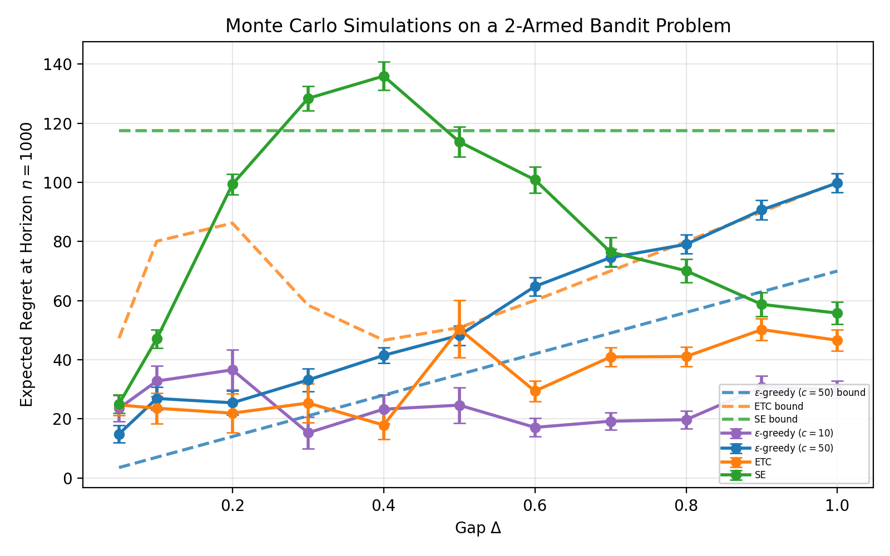
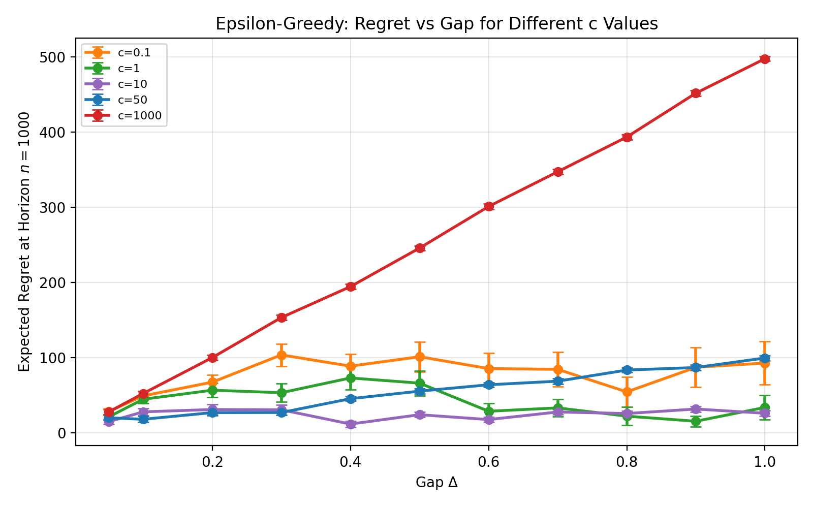

# Bandit Simulation Scaffold

This repository contains a Python codebase for simulating bandit algorithms on Gaussian bandit problems and comparing their empirical regret.

## Structure

```text
src/bandit_sim/
├── algorithms/
│   ├── base.py
│   ├── epsilon_greedy.py
│   ├── explore_then_commit.py
│   └── successive_elimination.py
├── bandits/
│   ├── base.py
│   └── n_armed_guassian_bandit.py
```

Top-level experiment files:

```text
main.py
epsilon_greedy_c_experiment.py
```

## Setup

Create and activate a virtual environment:

```bash
python3 -m venv .venv
source .venv/bin/activate
```

Install runtime dependencies:

```bash
pip install -e .
```

If you want the formatting tool too, install the project with dev dependencies:

```bash
pip install -e ".[dev]"
```

## Design

- `bandits/` contains environment classes that define the bandit problem.
- `algorithms/` contains strategy classes that choose which arm to pull and run simulations.
- Randomness uses NumPy's random generator API.
- `main.py` runs a two-armed Gaussian bandit delta sweep and saves both a plot and a JSON summary.
- `epsilon_greedy_c_experiment.py` runs the same delta sweep but only for epsilon-greedy across multiple `c` values.

## Quick Example

```python
from bandit_sim.algorithms import EpsilonGreedy
from bandit_sim.bandits import NArmedGaussianBandit

bandit = NArmedGaussianBandit(
    arm_means=(0.3, 0.7, 0.5),
    arm_stds=(1.0, 1.0, 1.0),
    seed=7,
)
algorithm = EpsilonGreedy(c=50.0, seed=7)

result = algorithm.run(bandit=bandit, horizon=100)

print(result.total_reward)
print(result.actions[:10])
```

## Multiple Runs

```python
batch = algorithm.run_n_simulations(
    bandit=bandit,
    horizon=100,
    n_simulations=10,
)

print(batch.total_rewards)
print(batch.average_total_reward)
```

## Delta Sweep Experiment

Run the main experiment with:

```bash
python main.py
```

This generates:

- `results/regret_vs_delta.png`: empirical average regret vs. delta with error bars
- `results/regret_vs_delta.json`: bandit means plus regret and standard error for each algorithm

The current experiment compares:

- `EpsilonGreedy (c=10)`
- `EpsilonGreedy (c=50)`
- `ExploreThenCommit`
- `SuccessiveElimination`

on a two-armed Gaussian bandit where one arm is optimal and the other is separated by a gap `delta`.

The plot also overlays theoretical bounds for:

- `EpsilonGreedy (c=50)`
- `ExploreThenCommit`
- `SuccessiveElimination`

### Plot



## Epsilon-Greedy c Sweep

Run the epsilon-greedy-only experiment with:

```bash
python epsilon_greedy_c_experiment.py
```

This evaluates epsilon-greedy for:

- `c = 0.1`
- `c = 1`
- `c = 10`
- `c = 50`
- `c = 1000`

and saves the plot to `results/epsilon_greedy_c_sweep.png`.

### Plot



## Outputs

The JSON summary stores, for each delta:

- arm means and standard deviations
- empirical average regret for each algorithm
- standard error for each algorithm

## Formatting

Format the code with:

```bash
ruff format .
```
